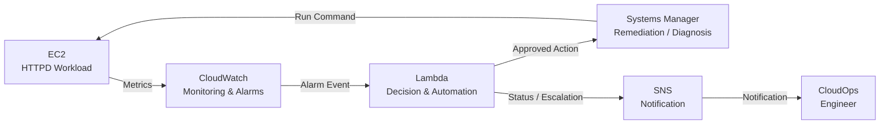
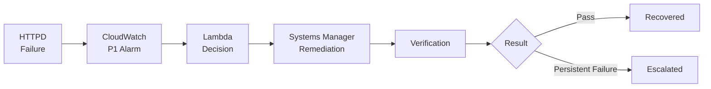
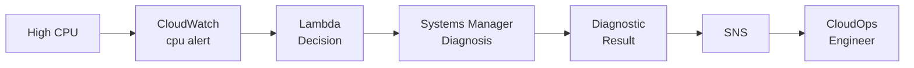
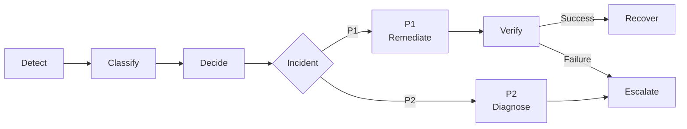

# CloudOps NOC Automation V2.0
## High-Level Design (HLD)

---

## 1. Document Information

| Item | Details |
|---|---|
| **Document Name** | High-Level Design (HLD) |
| **Project** | CloudOps NOC Automation |
| **Version** | 2.0 |
| **Prepared By** | Sujith |
| **Date** | August 2026 |
| **Status** | Final |

---

## 2. Overview

The **CloudOps NOC Automation V2.0** project is an event-driven AWS cloud operations solution designed to monitor predefined infrastructure incidents and perform controlled operational responses.

The project supports two incident priorities:

| Priority | Incident | Operational Response |
|---|---|---|
| **P1** | Apache HTTPD unavailable | Automated remediation + verification |
| **P2** | High EC2 CPU utilization | Automated diagnosis + manual review |

The overall operational model is:

```text
Detect
   ↓
Classify
   ↓
Decide
   ↓
Act
   ↓
Verify
   ↓
Recover / Escalate
```

Only recognized and approved alarms are allowed to enter the operational workflow.

---

## 3. Business Objective

The project is designed to reduce unnecessary manual intervention in repetitive operational incidents.

### Business Problem

```text
Repeated Infrastructure Incident
              ↓
Manual Intervention
              ↓
Delayed Remediation
              ↓
Higher MTTR
              ↓
Service Impact
              ↓
Higher Operational Effort
```

### Business Objectives

The solution aims to:

- Automatically detect predefined infrastructure incidents.
- Reduce manual intervention for known failures.
- Reduce Mean Time to Recovery (MTTR).
- Perform controlled P1 remediation.
- Collect diagnostic evidence for P2 incidents.
- Verify automated recovery.
- Prevent uncontrolled automation.
- Notify operators about incident status.
- Escalate unresolved incidents for human investigation.

---

## 4. Project Scope

CloudOps NOC Automation V2.0 supports exactly two incident priorities.

### P1 — HTTPD Failure

P1 represents a known service-level failure with a predefined recovery action.

```text
HTTPD Failure
      ↓
Detection
      ↓
Decision
      ↓
Automated Remediation
      ↓
Verification
      ↓
Recovery / Escalation
```

### P2 — High CPU Utilization

P2 represents a resource-performance condition that can have multiple causes.

```text
High CPU
   ↓
Detection
   ↓
Diagnosis
   ↓
Evidence Collection
   ↓
Notification
   ↓
Manual Review
```

> **P3 is intentionally excluded from the finalized V2.0 project scope.**

---

## 5. AWS Services

The implemented architecture uses seven AWS services.

| AWS Service | High-Level Responsibility |
|---|---|
| **Amazon VPC** | Network foundation and isolation |
| **Amazon EC2** | Hosts the HTTPD workload |
| **Amazon CloudWatch** | Monitoring and incident detection |
| **AWS Lambda** | Incident decision logic and orchestration |
| **AWS Systems Manager (SSM)** | Controlled EC2 command execution |
| **Amazon SNS** | Notification and escalation |
| **AWS IAM** | Authentication and authorization |

Supporting components running on EC2 include:

- Apache HTTP Server (`httpd`)
- CloudWatch Agent
- SSM Agent

---

# 6. High-Level Architecture

The architecture follows an event-driven operational model.

CloudWatch detects incidents, Lambda evaluates the alarm and determines the required response, Systems Manager performs controlled EC2 operations, and SNS communicates operational results or escalation information.



### High-Level Responsibility Flow

```text
EC2
 │
 │ Metrics
 ▼
CloudWatch
 │
 │ Alarm Event
 ▼
Lambda
 │
 │ Decision
 ▼
Systems Manager
 │
 │ Controlled Command
 ▼
EC2

Lambda
 │
 │ Result / Escalation
 ▼
SNS
 │
 ▼
CloudOps Engineer
```

The main service responsibilities are:

```text
CloudWatch       → Detect
Lambda           → Decide
Systems Manager  → Execute
EC2              → Workload / Command Target
SNS              → Notify / Escalate
IAM              → Authorize
VPC              → Network Foundation
```

---

## 7. Monitoring Design

Amazon CloudWatch provides centralized monitoring and alarm evaluation.

The architecture contains separate monitoring paths for P1 and P2.

### P1 Monitoring

P1 monitors the Apache HTTPD process.

```text
HTTPD
   ↓
CloudWatch Agent
   ↓
procstat
   ↓
procstat_lookup_pid_count
   ↓
CloudWatch
   ↓
NOC-cloudops-automate
```

The CloudWatch Agent monitors HTTPD using the `procstat` plugin.

The `procstat_lookup_pid_count` metric represents the number of matching HTTPD processes.

The P1 alarm is:

```text
NOC-cloudops-automate
```

When the configured process-count condition is met, the alarm enters the `ALARM` state and sends an alarm event to Lambda.

---

### P2 Monitoring

P2 uses the EC2 native CloudWatch metric:

```text
CPUUtilization
```

The monitoring path is:

```text
EC2
   ↓
CPUUtilization
   ↓
CloudWatch
   ↓
cpu alert
```

The P2 alarm is:

```text
cpu alert
```

P2 does not automatically restart the EC2 instance or HTTPD service.

Instead, it initiates diagnostic processing.

---

## 8. Lambda Decision Design

AWS Lambda acts as the central incident-processing and orchestration component.

At a high level:

```text
CloudWatch Alarm Event
          ↓
Alarm Parsing
          ↓
Check Alarm State
          ↓
Identify Alarm
          ↓
Actionable Alarm Gate
          ↓
Classify Incident
          ↓
P1 / P2 / Ignore
```

Lambda reads the CloudWatch alarm information from:

```python
event["alarmData"]
```

The function determines whether the event represents a supported actionable incident before any operational action is performed.

---

## 9. Actionable Alarm Gate

The **Actionable Alarm Gate** is a safety control used to prevent uncontrolled automation.

Only recognized alarms are allowed to continue.

| Alarm | Classification | Allowed Response |
|---|---|---|
| `NOC-cloudops-automate` | P1 | HTTPD remediation |
| `cpu alert` | P2 | CPU diagnosis |
| Unknown/Test Alarm | Unsupported | Ignore |

Conceptually:

```text
Alarm Event
     ↓
Recognized Alarm?
     │
 ┌───┴───┐
 │       │
YES      NO
 │       │
 ▼       ▼
Process  Ignore
```

Unknown alarms result in:

```text
No Remediation
No Diagnosis
No Operational Action
```

This ensures that automation runs only for explicitly supported incidents.

---

## 10. P1 — HTTPD Automated Recovery

P1 represents a known service failure with a known recovery action.

### P1 High-Level Flow



### P1 Operational Logic

```text
Known Failure
      +
Known Recovery Action
      +
Controlled Permission
      =
Automated Remediation
```

The high-level P1 lifecycle is:

```text
Detect
  ↓
Classify
  ↓
Remediate
  ↓
Verify
  ↓
Stability Check
  ↓
Recover / Escalate
```

---

## 11. P1 Remediation and Verification

Lambda requests Systems Manager to perform the approved HTTPD recovery operation.

Conceptually:

```text
Lambda
   ↓
Systems Manager
   ↓
SSM Agent
   ↓
EC2
   ↓
Restart HTTPD
```

The recovery action uses:

```bash
systemctl restart httpd
```

After remediation, HTTPD is verified using:

```bash
systemctl is-active httpd
```

The workflow also performs a stability verification after the service becomes active.

This prevents the automation from treating a temporary restart as a successful long-term recovery.

If the service remains unavailable after the configured recovery attempt, the incident is escalated.

---

## 12. P2 — CPU Diagnostic Workflow

P2 intentionally follows a different operational model.

High CPU utilization can have several possible causes, so automatic remediation is not considered safe without further context.

### P2 High-Level Flow



P2 follows:

```text
Detect
   ↓
Classify
   ↓
Diagnose
   ↓
Collect Evidence
   ↓
Notify
   ↓
Human Review
```

No automatic CPU remediation is performed.

---

## 13. Why P1 and P2 Are Different

The architecture intentionally separates **monitoring from remediation**.

### P1

HTTPD failure has:

- A known incident.
- A known service.
- A predefined corrective action.
- A verifiable recovery state.

Therefore:

```text
P1
 ↓
Controlled Automated Remediation
```

### P2

High CPU can result from:

- Increased application load.
- Traffic spikes.
- Background processes.
- Misbehaving applications.
- Resource contention.
- Configuration problems.
- Other unknown causes.

Therefore:

```text
P2
 ↓
Diagnosis
 ↓
Evidence
 ↓
Human Review
```

This prevents unsafe or unnecessary automatic corrective actions.

---

## 14. Systems Manager Design

AWS Systems Manager provides controlled command execution on EC2.

The communication model is:

```text
Lambda
   ↓
AWS SDK / Boto3
   ↓
SSM API
   ↓
AWS Systems Manager
   ↓
SSM Agent
   ↓
EC2
```

Lambda does not directly log in to the EC2 instance.

Systems Manager provides the management layer between the automation logic and the target EC2 instance.

### P1

```text
Lambda
   ↓
SSM
   ↓
HTTPD Remediation
   ↓
Verification
```

### P2

```text
Lambda
   ↓
SSM
   ↓
Diagnostic Commands
   ↓
Diagnostic Result
```

---

## 15. Notification and Escalation Design

Amazon SNS provides operational notification and escalation communication.

```text
Lambda
   ↓
SNS
   ↓
CloudOps / NOC Engineer
```

SNS can communicate:

- Incident information.
- Remediation result.
- Recovery status.
- Diagnostic result.
- Automation failure.
- Escalation information.

> SNS is the **notification mechanism**.  
> Escalation is the **operational process** of transferring an unresolved incident for human attention.

SNS is not the primary Lambda trigger in the finalized architecture.

The alarm event is sent directly from CloudWatch to Lambda.

---

## 16. Security Design

The architecture applies security at multiple layers.

```text
Network Security
VPC + Security Group
        ↓
Identity Security
IAM
        ↓
Automation Safety
Actionable Alarm Gate
        ↓
Controlled Execution
Systems Manager
        ↓
Target Workload
EC2
```

### IAM

IAM controls authentication and authorization between AWS services.

#### Trust Policy

Defines:

> **Who can assume the role?**

#### Permission Policy

Defines:

> **What can the role do?**

#### Resource-Based Policy

Defines access directly on supported AWS resources.

#### Explicit Deny

An explicit deny overrides an allow.

The design follows the principle of:

> **Least Privilege**

Only the permissions required by each component should be granted.

---

## 17. Network Design

Amazon VPC provides the network foundation for the workload.

At a high level:

```text
Internet
   ↓
Internet Gateway
   ↓
VPC
   ↓
Public Subnet
   ↓
Security Group
   ↓
EC2
```

The VPC architecture provides:

- Network isolation.
- Subnet placement.
- Routing.
- Internet connectivity.
- Security Group protection.

Detailed networking configuration belongs to the **Infrastructure / LLD documentation** rather than the HLD.

---

## 18. Incident Lifecycle

The overall incident lifecycle is:



The lifecycle demonstrates an important principle:

> **Automation does not mean automatically remediating every alarm.**

The operational response depends on the incident type and whether a safe predefined action exists.

---

## 19. Failure Handling

### P1 Recovery Failure

If HTTPD cannot be successfully recovered:

```text
P1 Incident
     ↓
Remediation
     ↓
Verification Failed
     ↓
Configured Recovery Attempt
     ↓
Persistent Failure
     ↓
Escalation
     ↓
SNS
     ↓
CloudOps Engineer
```

### P2

P2 collects diagnostic evidence and sends the result for operational review.

```text
High CPU
   ↓
Diagnosis
   ↓
Diagnostic Result
   ↓
SNS
   ↓
Human Investigation
```

### Unknown Alarm

Unsupported alarms are ignored.

```text
Unknown Alarm
     ↓
Actionable Alarm Gate
     ↓
IGNORE
```

No remediation or diagnostic action is executed.

---

## 20. Operational Responsibility Model

| Component | Responsibility |
|---|---|
| **CloudWatch** | Detect incidents |
| **Lambda** | Parse, classify and decide |
| **Systems Manager** | Execute approved commands |
| **EC2** | Host workload and execute commands |
| **SNS** | Notify and communicate escalation |
| **IAM** | Authorize access |
| **VPC** | Provide network foundation |
| **CloudOps Engineer** | Investigate unresolved incidents |

The responsibility model can be summarized as:

```text
CloudWatch
   ↓
DETECT

Lambda
   ↓
DECIDE

Systems Manager
   ↓
EXECUTE

EC2
   ↓
WORKLOAD / VERIFY

SNS
   ↓
NOTIFY

Engineer
   ↓
INVESTIGATE / RESPOND
```

---

## 21. Design Principles

### Event-Driven Architecture

Operational actions begin in response to events.

```text
Event
 ↓
Decision
 ↓
Action
```

---

### Controlled Automation

Only predefined and approved incidents are allowed to trigger operational actions.

---

### Separation of Monitoring and Remediation

Detecting an abnormal condition does not automatically mean corrective action should be executed.

---

### Human-in-the-Loop

Unknown, unsafe, diagnostic, or unresolved incidents remain available for human investigation.

---

### Verification

A remediation command being executed does not automatically mean that the service has recovered.

Recovery must be verified.

---

### Stability Verification

A service should remain healthy after remediation before recovery is considered stable.

---

### Least Privilege

AWS services receive only the permissions required to perform their responsibilities.

---

### Reduced MTTR

Automating predefined incident-response steps can reduce the time required to restore service.

---

## 22. Current Limitations

CloudOps NOC Automation V2.0 intentionally remains within a limited project scope.

Current limitations include:

- Single EC2 workload.
- Single-AZ architecture.
- No Multi-AZ high availability.
- No Auto Scaling.
- No load balancer.
- No automated infrastructure replacement.
- P1 remediation is limited to predefined HTTPD failures.
- P2 is diagnostic-only.
- P3 is intentionally excluded.
- No complete disaster recovery implementation.
- No centralized backup and restore architecture.
- Automation depends on CloudWatch alarm evaluation.
- Human investigation is required for unsupported or unresolved incidents.

---

## 23. Future Improvements

Possible future production improvements include:

```text
Current V2.0
     ↓
Multi-AZ Architecture
     ↓
Load Balancing
     ↓
Auto Scaling
     ↓
Automated Instance Replacement
     ↓
Backup / Restore Strategy
     ↓
Defined RTO / RPO
     ↓
Additional Incident Types
     ↓
Expanded Diagnostics
     ↓
Infrastructure as Code
```

These are future possibilities and are **not implemented components of the current V2.0 architecture**.

---

## 24. HLD Summary

The entire high-level design can be summarized as:

```text
                   CLOUDOPS NOC V2.0

                         EC2
                          │
                       Metrics
                          │
                          ▼
                     CloudWatch
                          │
                     Alarm Event
                          │
                          ▼
                       Lambda
                          │
                   Classify / Decide
                          │
                 ┌────────┴────────┐
                 │                 │
                P1                P2
                 │                 │
            Remediation        Diagnosis
                 │                 │
                 └────────┬────────┘
                          │
                         SSM
                          │
                          ▼
                         EC2
                          │
                     Result / Status
                          │
                          ▼
                         SNS
                          │
                          ▼
                  CloudOps Engineer
```

### P1

```text
Detect
→ Decide
→ Remediate
→ Verify
→ Recover / Escalate
```

### P2

```text
Detect
→ Decide
→ Diagnose
→ Notify
→ Human Review
```

---

## 25. Conclusion

The **CloudOps NOC Automation V2.0 High-Level Design** demonstrates an AWS-native, event-driven approach to controlled incident management.

The architecture follows:

> **Detect → Classify → Decide → Act → Verify → Recover / Escalate**

For P1 HTTPD incidents:

```text
CloudWatch
→ Lambda
→ Systems Manager
→ EC2
→ Verification
→ SNS
```

For P2 CPU incidents:

```text
CloudWatch
→ Lambda
→ Systems Manager
→ Diagnosis
→ SNS
→ Human Review
```

The project demonstrates that effective CloudOps automation is not about automatically fixing every alarm.

Instead, the architecture determines whether an incident is recognized and actionable, performs controlled operations where appropriate, verifies the result, and retains human involvement for diagnostic, unsupported, or unresolved incidents.

---

## Documentation

Related project documentation:

- `README.md` — Project overview
- `docs/BRD.md` — Business Requirements Document
- `docs/HLD.md` — High-Level Design
- `docs/LLD.md` — Low-Level Design
- `docs/INFRASTRUCTURE.md` — AWS infrastructure implementation
- `docs/SECURITY.md` — IAM and security design
- `docs/TESTING.md` — Testing and validation
- `docs/TROUBLESHOOTING.md` — Troubleshooting procedures
