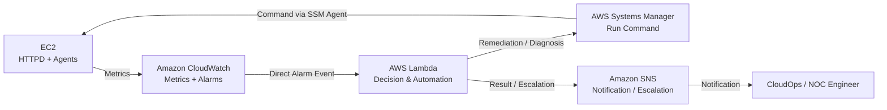
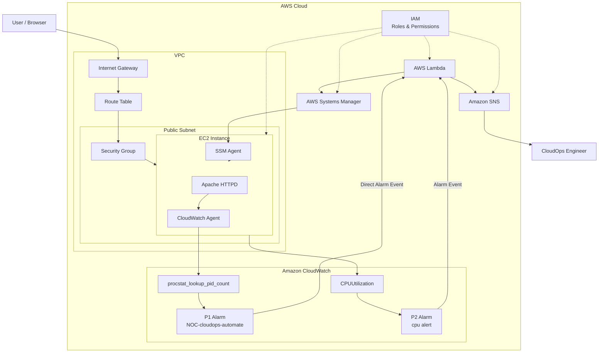
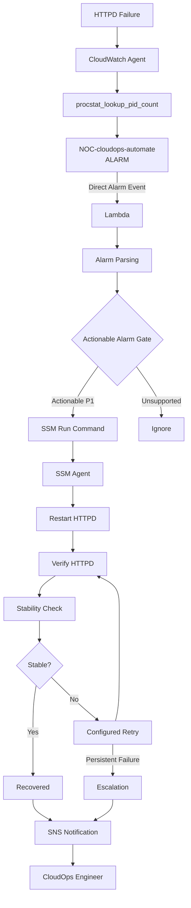
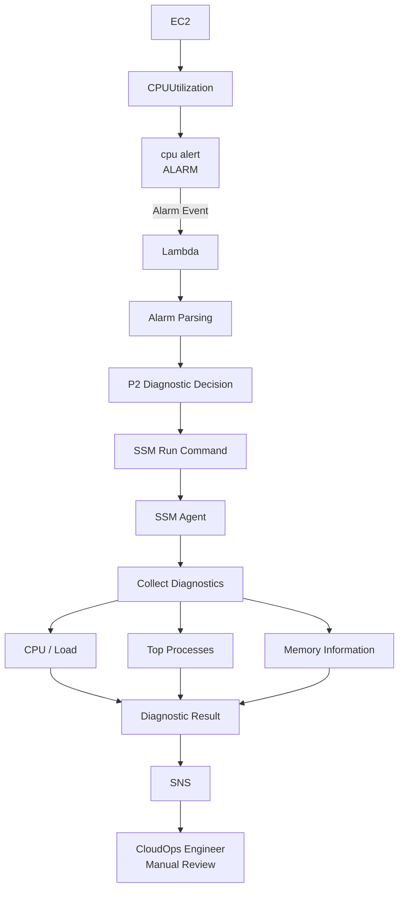
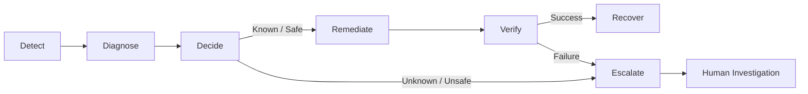

# CloudOps NOC Automation V2.0 — Infrastructure

## Overview

This document describes the infrastructure used in the **CloudOps NOC Automation V2.0** project.

The project applies traditional **NOC operational principles** to an AWS cloud environment and demonstrates how predefined infrastructure incidents can be monitored, evaluated, remediated, verified, and escalated using AWS-native services.

The project supports two incident severities:

* **P1 — HTTPD Failure:** Automated remediation and recovery verification.
* **P2 — High CPU Utilization:** Automated diagnosis with manual operational review.

The solution uses exactly seven AWS services:

* Amazon EC2
* Amazon VPC
* Amazon CloudWatch
* AWS Lambda
* AWS Systems Manager
* Amazon SNS
* AWS IAM

---

# 1. Infrastructure Objective

The infrastructure is designed to reduce unnecessary manual intervention in repetitive operational incidents.

Instead of requiring an engineer to manually detect, access, troubleshoot, remediate, and verify every known incident, the architecture provides a controlled event-driven workflow.

```text
Detect
   ↓
Decide
   ↓
Act
   ↓
Verify
   ↓
Recover / Escalate
```

The objective is not to remove the operations engineer.

The objective is to automate safe and predictable operational actions while keeping engineers involved for unknown, unsafe, or unresolved incidents.

---

# 2. High-Level Architecture



---

# 3. AWS Services Used

| AWS Service         | Role in the Project                                                          |
| ------------------- | ---------------------------------------------------------------------------- |
| **VPC**             | Provides the network foundation and isolation for the EC2 workload           |
| **EC2**             | Hosts the Apache HTTPD web service and monitoring/management agents          |
| **CloudWatch**      | Collects metrics, evaluates alarms, and detects incidents                    |
| **Lambda**          | Parses alarm events, applies decision logic, and controls incident workflows |
| **Systems Manager** | Executes controlled commands and diagnostics on EC2                          |
| **SNS**             | Sends incident, recovery, diagnostic, and escalation notifications           |
| **IAM**             | Controls permissions and service-to-service access                           |

---

# 4. Infrastructure Layout



---

# 5. Network Infrastructure

## VPC

The VPC provides the network boundary for the project.

```text
AWS Region
    ↓
VPC
    ↓
Public Subnet
    ↓
EC2 Instance
```

The VPC contains:

* Public subnet
* Route table
* Internet Gateway
* Security Group
* EC2 instance

---

## Public Subnet

The EC2 instance is deployed inside a public subnet.

The subnet provides the network placement for the workload.

---

## Internet Gateway

The Internet Gateway provides internet connectivity for resources in the VPC when routing and security rules allow it.

```text
Internet
   ↓
Internet Gateway
   ↓
VPC Routing
   ↓
EC2
```

---

## Route Table

The route table determines where network traffic should be forwarded.

The public subnet contains a route similar to:

```text
Destination: 0.0.0.0/0
Target: Internet Gateway
```

---

## Security Group

The Security Group acts as a stateful virtual firewall for the EC2 instance.

Typical project access includes:

| Port | Protocol | Purpose                   |
| ---- | -------- | ------------------------- |
| 22   | TCP      | Administrative SSH access |
| 80   | TCP      | HTTP / Apache web access  |

Automated remediation itself is performed using **AWS Systems Manager**, not through automated SSH login.

---

# 6. Compute Infrastructure

Amazon EC2 hosts the main application workload.

The instance contains:

```text
EC2
│
├── Apache HTTPD
│
├── CloudWatch Agent
│
└── SSM Agent
```

### Apache HTTPD

HTTPD provides the web service used for the P1 incident scenario.

### CloudWatch Agent

The CloudWatch Agent collects additional operating-system and application-level monitoring information.

For P1, it monitors the HTTPD process using the `procstat` plugin.

### SSM Agent

The SSM Agent allows AWS Systems Manager to securely execute commands on the EC2 instance.

---

# 7. Monitoring Infrastructure

Amazon CloudWatch is the central monitoring service.

Two finalized incident types are monitored.

---

## P1 — HTTPD Failure

P1 monitors the Apache HTTPD process.

```text
HTTPD
   ↓
CloudWatch Agent
   ↓
procstat
   ↓
procstat_lookup_pid_count
   ↓
CloudWatch
   ↓
NOC-cloudops-automate
```

The `procstat_lookup_pid_count` metric represents the number of matching HTTPD processes.

When the process count falls below the configured threshold, the CloudWatch alarm can enter the `ALARM` state.

### P1 Alarm

```text
Alarm Name:
NOC-cloudops-automate
```

Response:

```text
Automatic Remediation
```

---

# 8. P2 — CPU Utilization

P2 uses the EC2 native metric:

```text
CPUUtilization
```

Flow:

```text
EC2
   ↓
CPUUtilization
   ↓
CloudWatch
   ↓
cpu alert
```

### P2 Alarm

```text
Alarm Name:
cpu alert
```

Response:

```text
Diagnostic Only
```

P2 does not automatically restart the instance or services.

High CPU can have multiple causes, so diagnosis is performed before human review.

---

# 9. P1 Automated Remediation Workflow



---

# 10. P1 Remediation Command

Systems Manager executes the Linux service recovery command on EC2.

Conceptually:

```bash
systemctl restart httpd
```

After remediation, Lambda does not automatically assume that recovery was successful.

Verification is performed.

```bash
systemctl is-active httpd
```

The workflow then performs a stability check to confirm that HTTPD remains active.

---

# 11. P1 Incident Lifecycle

```text
HTTPD Failure
      ↓
Detection
      ↓
CloudWatch Alarm
      ↓
Direct Alarm Event
      ↓
Lambda
      ↓
Alarm Parsing
      ↓
Actionable Alarm Gate
      ↓
SSM
      ↓
Remediation
      ↓
Verification
      ↓
Stability Check
      ↓
┌─────────────┐
│             │
PASS         FAIL
│             │
Recovery     Retry / Escalation
│             │
└──────┬──────┘
       ↓
      SNS
       ↓
CloudOps Engineer
```

---

# 12. P2 Diagnostic Workflow



P2 follows:

```text
Detect
   ↓
Diagnose
   ↓
Collect Information
   ↓
Notify
   ↓
Manual Review
```

No automatic CPU remediation is performed.

---

# 13. Lambda Automation Layer

AWS Lambda acts as the decision and automation engine.

The main workflow is:

```text
Receive CloudWatch Alarm Event
          ↓
Parse event["alarmData"]
          ↓
Extract Alarm Information
          ↓
Actionable Alarm Gate
          ↓
Identify P1 / P2
          ↓
Execute Approved Workflow
```

For P1:

```text
Lambda
   ↓
SSM
   ↓
Restart HTTPD
   ↓
Verify
```

For P2:

```text
Lambda
   ↓
SSM
   ↓
Collect Diagnostics
   ↓
Report
```

---

# 14. Actionable Alarm Gate

The Actionable Alarm Gate protects the automation workflow.

Instead of executing automation for every alarm:

```text
Alarm
   ↓
Is this a recognized actionable alarm?
        ↓
   ┌────┴────┐
   │         │
  YES        NO
   │         │
   ↓         ↓
Process    Ignore
```

This reduces the risk of uncontrolled remediation.

---

# 15. Systems Manager Layer

AWS Systems Manager provides controlled command execution on EC2.

The automation path is:

```text
Lambda
   ↓
AWS SDK / Boto3
   ↓
SSM API
   ↓
Systems Manager
   ↓
SSM Agent
   ↓
EC2
   ↓
Linux Command
```

Lambda does not directly log in to the EC2 instance.

Systems Manager acts as the management layer between Lambda and EC2.

---

# 16. Notification and Escalation Layer

Amazon SNS is used after incident processing to deliver operational notifications.

```text
Lambda
   ↓
SNS
   ↓
CloudOps / NOC Engineer
```

SNS may communicate:

* Incident detected
* Remediation status
* Recovery status
* Diagnostic results
* Automation failure
* Escalation requirement

SNS is used for **notification and escalation**, not as the primary Lambda trigger in the finalized architecture.

---

# 17. IAM Security

AWS IAM controls service-to-service access.

The main concepts are:

### Trust Policy

Defines:

> Who can assume the IAM role?

Example:

```text
Lambda Service
      ↓
Trust Policy
      ↓
Lambda Execution Role
```

### Permission Policy

Defines:

> What actions can the role perform?

Example:

```text
Lambda Role
    ↓
Permission Policy
    ↓
ssm:SendCommand
```

### Resource-Based Policy

A resource-based policy is attached directly to an AWS resource and defines which principals may access or invoke it.

### Explicit Deny

An explicit deny overrides an allow.

```text
Allow + Explicit Deny
        ↓
       DENY
```

The project follows the principle of **least privilege** wherever possible.

---

# 18. Incident Management Model

The operational model can be represented as:



---

# 19. Automation vs Human Operations

The project does not attempt to automate every incident.

### P1

```text
Known Failure
+
Known Safe Recovery
=
Automated Remediation
```

### P2

```text
Abnormal Condition
+
Multiple Possible Causes
=
Diagnosis + Human Review
```

This separates:

> Monitoring from remediation.

An alarm does not automatically mean that destructive action should be performed.

---

# 20. Reliability and MTTR

The project improves operational reliability through:

* Automated incident detection
* Event-driven response
* Controlled remediation
* Verification
* Stability checking
* Retry limitation
* Escalation
* Human review where appropriate

One of the main goals is to reduce:

**MTTR — Mean Time To Recovery**

Instead of:

```text
Alarm
 ↓
Engineer notices
 ↓
Engineer connects
 ↓
Engineer investigates
 ↓
Engineer restarts
 ↓
Engineer verifies
```

P1 can follow:

```text
Alarm
 ↓
Lambda
 ↓
SSM
 ↓
Restart
 ↓
Verify
```

---

# 21. Traffic Flow

The web request path can be understood as:

```text
User
 ↓
Browser
 ↓
Internet
 ↓
Internet Gateway
 ↓
VPC Routing
 ↓
Security Group
 ↓
EC2 ENI
 ↓
ens5
 ↓
NIC Driver
 ↓
Linux Kernel
 ↓
IP
 ↓
TCP :80
 ↓
Socket
 ↓
HTTPD
```

Response:

```text
HTTPD
 ↓
Socket
 ↓
TCP
 ↓
IP
 ↓
Linux Kernel
 ↓
NIC Driver
 ↓
ens5
 ↓
EC2 ENI
 ↓
VPC Routing
 ↓
Internet Gateway
 ↓
Internet
 ↓
Browser
```

---

# 22. Infrastructure Benefits

The current architecture provides:

* Centralized AWS monitoring
* P1 automatic HTTPD recovery
* P2 automated diagnostic collection
* Reduced manual intervention for predefined incidents
* Event-driven automation
* Controlled SSM command execution
* Recovery verification
* Stability verification
* Human escalation
* IAM-controlled permissions
* AWS-native service integration
* Lower operational complexity for the project scope

---

# 23. Current Limitations

CloudOps NOC V2.0 is intentionally limited in scope.

Current limitations include:

* Single EC2 workload
* Single-AZ architecture
* No Multi-AZ high availability
* No Auto Scaling Group
* No load balancer
* No automated infrastructure replacement
* No complete disaster recovery implementation
* No centralized backup and restore architecture
* P1 remediation supports predefined HTTPD incidents only
* P2 CPU incidents remain diagnostic-only
* Automation depends on CloudWatch metric and alarm evaluation
* Retry behavior is intentionally limited rather than unlimited

---

# 24. Future Improvements

Possible production improvements include:

```text
Current V2.0
     ↓
Multi-AZ Architecture
     ↓
Load Balancer
     ↓
Auto Scaling
     ↓
Automated Instance Replacement
     ↓
Centralized Backup
     ↓
Defined RTO / RPO
     ↓
Additional Incident Types
     ↓
Expanded Diagnostics
     ↓
Infrastructure as Code
```

These are future possibilities and are not part of the current implemented V2.0 service scope.

---

# 25. Architecture Summary

```text
                    CloudOps NOC V2.0

                         EC2
                    HTTPD Service
                         │
              ┌──────────┴──────────┐
              │                     │
      CloudWatch Agent        CPUUtilization
              │                     │
     procstat_lookup           CloudWatch
       _pid_count                  │
              │                 cpu alert
          CloudWatch                 │
              │                     │
 NOC-cloudops-automate              │
              │                     │
              └──────────┬──────────┘
                         │
                 CloudWatch Alarm
                         │
                  Direct Event
                         │
                         ▼
                       Lambda
                         │
                 Alarm Parsing
                         │
               Actionable Alarm Gate
                         │
                 ┌───────┴───────┐
                 │               │
                P1              P2
                 │               │
            Remediation       Diagnosis
                 │               │
                 └───────┬───────┘
                         │
                        SSM
                         │
                     SSM Agent
                         │
                        EC2
                         │
                 Result / Status
                         │
                       Lambda
                         │
                        SNS
                         │
                 CloudOps Engineer
```

---

# Conclusion

CloudOps NOC Automation V2.0 demonstrates a controlled AWS-native operational architecture for monitoring and incident response.

The architecture separates **detection, diagnosis, decision, remediation, verification, recovery, and escalation**.

P1 HTTPD failures use controlled automated remediation through:

```text
CloudWatch
→ Lambda
→ Systems Manager
→ EC2
→ Verification
→ SNS
```

P2 CPU incidents use:

```text
CloudWatch
→ Lambda
→ Systems Manager
→ Diagnostics
→ SNS
→ Human Review
```

The project demonstrates that cloud automation should not simply execute actions for every alarm.

Instead, safe automation should follow:

> **Detect → Decide → Act → Verify → Recover or Escalate**
