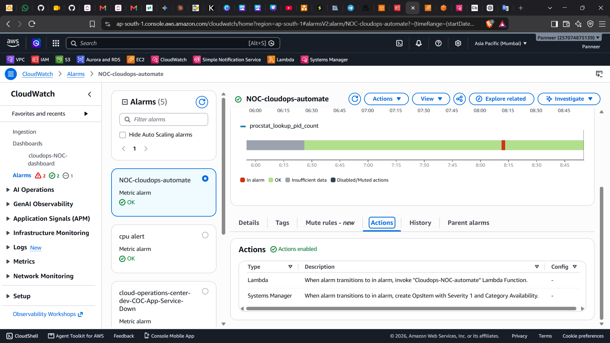
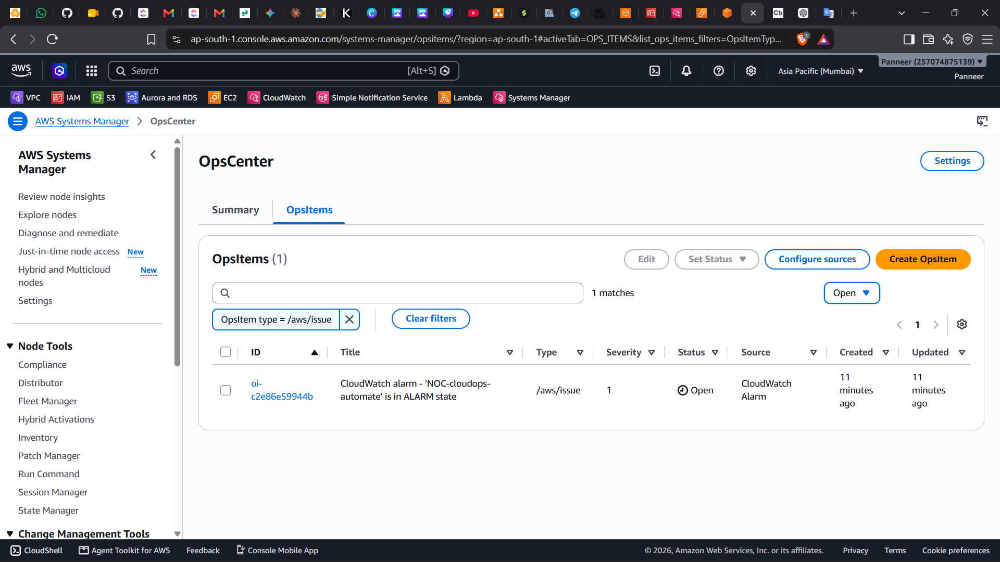
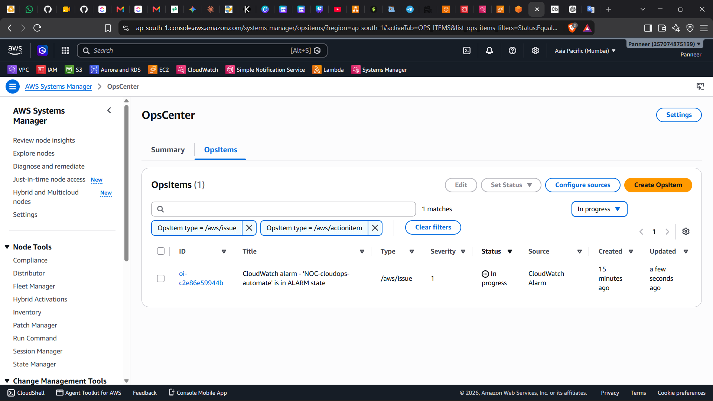
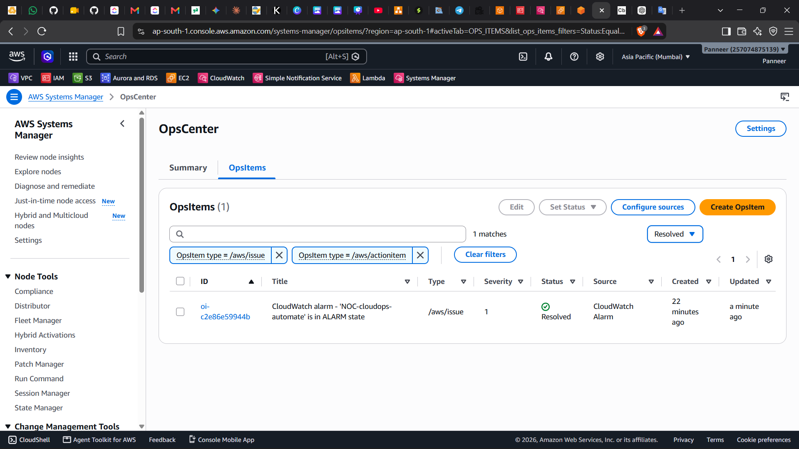

SSM OpsCenter Enhancement

Post-Review Enhancement

This folder documents a post-review enhancement added after the original CloudOps NOC Automation V2.0 baseline was reviewed.

The original reviewed baseline remains unchanged:

CloudWatch Alarm → Lambda → SSM Run Command → EC2 → Verification → SNS

This enhancement adds AWS Systems Manager OpsCenter as a parallel incident-tracking path for the P1 HTTPD alarm.

1) Enhancement Overview

What stayed the same

P1 still uses:

CloudWatch Agent

procstat_lookup_pid_count

NOC-cloudops-automate

Lambda

SSM Run Command

HTTPD remediation

SNS notification / escalation

P2 remains:

CPU diagnostic-only

No automatic CPU remediation

What was added

A parallel CloudWatch alarm action to create an OpsItem in Systems Manager OpsCenter

2) Base Project Scope

Item

Value

Project

CloudOps NOC Automation

Baseline version

V2.0

Enhancement

Systems Manager OpsCenter

Enhancement timing

Post-review

P1 alarm

NOC-cloudops-automate

P2

Diagnostic-only

AWS service scope

IAM, EC2, VPC, CloudWatch, SNS, Systems Manager, Lambda

Important: OpsCenter is a capability of Systems Manager, not a separate eighth AWS service.

3) Why This Enhancement Was Added

The original V2.0 project could:

detect the incident,

decide the action,

remediate the issue,

verify the result,

and notify or escalate.

But it did not maintain a formal incident record inside OpsCenter.

This enhancement adds:

incident recording

incident tracking

status management

OpsItem lifecycle visibility

4) Reviewed V2.0 Baseline Architecture

flowchart TD
    A[HTTPD Failure] --> B[CloudWatch Agent]
    B --> C[procstat_lookup_pid_count]
    C --> D[NOC-cloudops-automate]
    D --> E[Lambda]
    E --> F[Alarm Parsing]
    F --> G[Actionable Alarm Gate]
    G --> H[SSM Run Command]
    H --> I[SSM Agent on EC2]
    I --> J[systemctl restart httpd]
    J --> K[Verification]
    K --> L[Stability Check]
    L --> M[SNS Recovery or Escalation]

This is still the reviewed remediation baseline.

5) New OpsCenter Path

flowchart TD
    A[NOC-cloudops-automate] --> B[Systems Manager OpsCenter]
    B --> C[OpsItem Created]
    C --> D[Open]
    D --> E[In Progress]
    E --> F[Resolved]

This path is added, not substituted.

6) Combined Enhanced Architecture

flowchart TD
    A[HTTPD Failure] --> B[CloudWatch Agent]
    B --> C[procstat_lookup_pid_count]
    C --> D[NOC-cloudops-automate]

    D --> E[Lambda]
    D --> F[SSM OpsCenter]

    E --> G[Alarm Parsing]
    G --> H[Actionable Alarm Gate]
    H --> I[SSM Run Command]
    I --> J[SSM Agent on EC2]
    J --> K[systemctl restart httpd]
    K --> L[Verification]
    L --> M[Stability Check]
    M --> N[SNS Recovery Notification]
    M --> O[SNS Escalation]

    F --> P[OpsItem]
    P --> Q[Open]
    Q --> R[In Progress]
    R --> S[Resolved]

Key point

CloudWatch → Lambda remains the remediation path

CloudWatch → OpsCenter is the incident-tracking path

These two actions are parallel

7) Systems Manager Responsibilities

Systems Manager capability

Responsibility

Run Command

Controlled command execution on EC2

OpsCenter

Incident recording and tracking

SSM Agent

Receives and executes Systems Manager commands on EC2

Technical remediation path

Lambda → Boto3 → SSM SendCommand → AWS-RunShellScript → SSM Agent → EC2

Operational tracking path

CloudWatch Alarm → OpsCenter → OpsItem → Status Tracking

8) What Is an OpsItem?

An OpsItem is an operational work item in Systems Manager OpsCenter.

For this enhancement, when the P1 alarm enters the ALARM state, OpsCenter creates an OpsItem.

Example test values

Field

Value

Source

CloudWatch Alarm

Alarm

NOC-cloudops-automate

Severity

1

Initial status

Open

9) OpsItem Status Lifecycle

A) When automatic recovery succeeds

flowchart TD
    A[Alarm Triggered] --> B[OpsItem Open]
    B --> C[Lambda + SSM Recovery]
    C --> D[Verification Success]
    D --> E[SNS Recovery Notification]
    E --> F[Engineer Review]
    F --> G[Resolved]

Typical status flow:

Open → Resolved

B) When automatic recovery fails

flowchart TD
    A[Alarm Triggered] --> B[OpsItem Open]
    B --> C[Lambda + SSM Recovery Attempt]
    C --> D[Recovery Failure]
    D --> E[SNS Escalation]
    E --> F[Engineer Investigation]
    F --> G[In Progress]
    G --> H[Manual / Additional Action]
    H --> I[Resolved]

Typical status flow:

Open → In Progress → Resolved

10) Before vs After

Before enhancement

flowchart TD
    A[NOC-cloudops-automate] --> B[Lambda]
    B --> C[Existing Automated Remediation]

After enhancement

flowchart TD
    A[NOC-cloudops-automate] --> B[Lambda]
    A[NOC-cloudops-automate] --> C[SSM OpsCenter]
    B --> D[Existing Automated Remediation]
    C --> E[OpsItem]

11) IAM Behavior

The OpsCenter alarm action is separate from the Lambda execution role.

Conceptual flow

CloudWatch Alarm
    ↓
Service-linked role
    ↓
ssm:CreateOpsItem
    ↓
Systems Manager OpsCenter

This does not replace:

Lambda execution role permissions

EC2 instance role permissions

SSM Run Command permissions

12) Test Flow

flowchart TD
    A[HTTPD intentionally stopped] --> B[CloudWatch Agent publishes procstat]
    B --> C[procstat_lookup_pid_count shows HTTPD down]
    C --> D[NOC-cloudops-automate becomes ALARM]
    D --> E[Lambda remediation path]
    D --> F[OpsCenter creates OpsItem]
    E --> G[HTTPD recovery verified]
    F --> H[OpsItem Open]
    G --> I[Engineer review]
    H --> I
    I --> J[OpsItem Resolved]

13) Test Results

Test Item

Result

P1 detection worked

✅ Passed

Lambda remediation remained active

✅ Passed

OpsCenter created OpsItem

✅ Passed

OpsItem captured alarm source

✅ Passed

Severity 1 recorded

✅ Passed

SSM remediation continued to work

✅ Passed

HTTPD recovery verified

✅ Passed

OpsItem status updated manually

✅ Passed

OpsItem resolved successfully

✅ Passed

14) Included Evidence

The following screenshots are part of this folder:

OPSCENTER ARCHITECTURE.png

OPSCENTER-CW-action.png

OPSCENTER-open-incidet.png

OPSCENETR-inprogress-incident.png

OPSCENTER-resolve-incident.png

Example image links

15) Remediation vs Incident Tracking

Function

Responsibility

CloudWatch

Detect

Lambda

Decide / orchestrate

SSM Run Command

Execute remediation

systemd

Manage HTTPD

SNS

Notify / escalate

SSM OpsCenter

Record / track incident

Important distinction

Remediation = fixing the technical issue

OpsCenter = tracking the operational incident

This enhancement uses Systems Manager OpsCenter, not Systems Manager Incident Manager.

16) Current Limitations

OpsItem status changes are manual

Lambda does not automatically update the OpsItem

Lambda recovery result is not automatically linked to an OpsItem

OpsItem assignment is manual

Incident timing metrics are not automated

This enhancement applies to P1 HTTPD only

P2 remains diagnostic-only

17) Future Possibilities

Possible future improvements:

automatic OpsItem resolution after successful verified recovery

automatic move to In Progress on recovery failure

linking Lambda incident data to the OpsItem

assigning an incident owner

adding response / resolution metrics

dashboard integration

incident reporting

18) Conclusion

This enhancement improves the project by adding formal operational incident tracking while preserving the original reviewed V2.0 architecture.

Final idea

Reviewed baseline

CloudWatch → Lambda → SSM Run Command → EC2 → Verification → SNS

Post-review enhancement

CloudWatch → SSM OpsCenter → OpsItem

So the project now demonstrates both:

technical incident response

operational incident tracking
